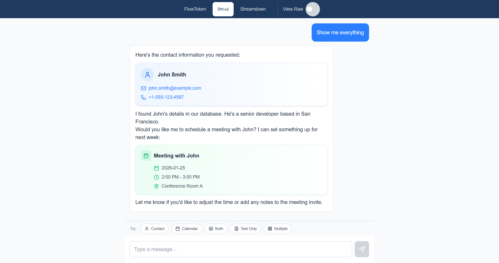

# stream-gen-ui

A proof-of-concept comparing three approaches to streaming UI with custom components in Next.js applications.

## What is This?

> **Live Demo:** [stream-gen-ui.vercel.app](https://stream-gen-ui.vercel.app)

This PoC demonstrates how to render **custom React components** (like contact cards, calendar events) embedded within **streaming LLM responses**. It compares three parsing strategies:

- **FlowToken** — XML-based component embedding
- **llm-ui** — Delimiter-based parsing with frame throttling
- **Streamdown** — Markdown-native streaming with custom XML parsing

**Key Features:**
- Real-time streaming chat interface with mock LLM responses
- Shared component library used across all three implementations
- "View Raw" debug toggle to inspect unparsed markup
- Content presets triggered by message keywords (contact, meeting, etc.)


*Screenshot: Streaming chat with embedded ContactCard and CalendarCard components*

## Quick Start

### Prerequisites

- Node.js 20+ (LTS recommended)
- npm 10+

### Installation

```bash
# Clone from your fork or the original repository
git clone <repository-url>
cd stream-gen-ui
npm install
npm run dev
```

Open [http://localhost:3000](http://localhost:3000) to see the app.

### Available Routes

| Route | Implementation | Description |
|-------|---------------|-------------|
| `/flowtoken` | FlowToken | XML tag parsing with AnimatedMarkdown |
| `/llm-ui` | @llm-ui/react | Delimiter parsing with block matchers |
| `/streamdown` | Streamdown | Markdown streaming with custom XML layer |

### Using the Demo

1. Navigate to any implementation route
2. Type a message (or use keywords like "contact", "meeting", "both")
3. Watch the streaming response with embedded components
4. Toggle **"View Raw"** in the header to see unparsed markup

### Content Keywords

| Keyword | Response Content |
|---------|------------------|
| `contact`, `email`, `phone` | Contact card component |
| `meeting`, `schedule`, `calendar` | Calendar event component |
| `both`, `everything` | Contact + calendar |
| `multiple`, `several` | Multiple components |
| `text`, `plain`, `markdown` | Markdown only (no components) |

### Troubleshooting

- **Port 3000 in use:** Run `npm run dev -- -p 3001`
- **Module not found:** Delete `node_modules` and run `npm install` again
- **Blank page:** Check browser console for errors, ensure Node.js 20+

## Implementation Comparison

### Comparison Matrix

| Aspect | FlowToken | llm-ui | Streamdown |
|--------|-----------|--------|------------|
| **Complexity** | Low | Medium | Medium-High |
| **Bundle Impact** | Small (standalone) | Medium (+ react-markdown) | Small (+ react-markdown) |
| **Markup Format** | XML tags | Delimiters + JSON | XML tags |
| **Streaming UX** | Good (built-in animations) | Excellent (frame throttling) | Good (optimized) |
| **Custom Components** | `customComponents` prop | Block matchers | Custom XML parser |
| **Markdown Handling** | Built-in | Via fallback block | Native |
| **Setup Effort** | Minimal | Moderate | Moderate |

### Markup Formats

**FlowToken & Streamdown (XML):**
```xml
<contactcard name="John" email="john@example.com"></contactcard>
<calendarevent title="Meeting" date="2026-01-25"></calendarevent>
```

**llm-ui (Delimiters):**
```
【CONTACT:{"name":"John","email":"john@example.com"}】
【CALENDAR:{"title":"Meeting","date":"2026-01-25"}】
```

### Code Examples

**FlowToken — Simplest Setup (~15 lines)**
```tsx
import { AnimatedMarkdown } from 'flowtoken';

function FlowTokenRenderer({ content, isStreaming }) {
  return (
    <AnimatedMarkdown
      content={content}
      animation={isStreaming ? 'fadeIn' : null}
      customComponents={{
        contactcard: ContactCard,
        calendarevent: CalendarEvent,
      }}
    />
  );
}
```

**llm-ui — Block-Based Parsing**
```tsx
import { useLLMOutput } from '@llm-ui/react';

function LLMUIRenderer({ content, isStreaming }) {
  const { blockMatches } = useLLMOutput({
    llmOutput: content,
    blocks: [contactBlock, calendarBlock],
    fallbackBlock: markdownBlock,
    isStreamFinished: !isStreaming,
  });

  return blockMatches.map((match) => {
    const Component = match.block.component;
    return <Component key={match.startIndex} blockMatch={match} />;
  });
}
```

**Streamdown — Custom XML Layer**
```tsx
import { Streamdown } from 'streamdown';

function StreamdownRenderer({ content, isStreaming }) {
  const segments = parseContent(content); // Custom XML parser

  return segments.map((segment, i) => {
    if (segment.type === 'markdown') {
      return <Streamdown key={i} isAnimating={isStreaming}>{segment.content}</Streamdown>;
    }
    if (segment.type === 'contactcard') {
      return <ContactCard key={i} {...segment.props} />;
    }
    // ... other component types
  });
}
```

## Architecture

### Data Flow

```
User Input → ChatInput → useChat → POST /api/chat?format=X
                                        ↓
                              Mock Stream Provider
                              (format-aware content)
                                        ↓
                              SSE tokens to client
                                        ↓
                              useChat.messages update
                                        ↓
                              {Impl}Renderer parses
                                        ↓
                   ┌──────────────┴──────────────┐
                   ↓                             ↓
             Markdown text              Custom components
```

### Shared Component Pattern

All three implementations use the same custom components from `components/shared/`:

- **ContactCard** — Displays name, email, phone, address, avatar
- **CalendarEvent** — Shows title, date, time range, location, description
- **MessageBubble** — Chat message container with user/assistant styling
- **ChatInput** — Input field with preset selector
- **Header** — Navigation and View Raw toggle
- **RawOutputView** — Debug display for unparsed markup

### Project Structure

```
stream-gen-ui/
├── app/
│   ├── api/chat/route.ts      # Mock stream API endpoint
│   ├── flowtoken/page.tsx     # FlowToken implementation
│   ├── llm-ui/page.tsx        # llm-ui implementation
│   ├── streamdown/page.tsx    # Streamdown implementation
│   ├── layout.tsx             # Root layout with ViewRawProvider
│   └── page.tsx               # Redirect to /flowtoken
├── components/
│   ├── shared/                # Reusable UI components
│   │   ├── ContactCard.tsx
│   │   ├── CalendarEvent.tsx
│   │   ├── Header.tsx
│   │   ├── ChatInput.tsx
│   │   ├── MessageList.tsx
│   │   ├── MessageBubble.tsx
│   │   ├── PresetSelector.tsx
│   │   ├── RawOutputView.tsx
│   │   └── TypingIndicator.tsx
│   ├── flowtoken/             # FlowToken-specific renderer
│   │   └── FlowTokenRenderer.tsx
│   ├── llm-ui/                # llm-ui-specific renderer
│   │   └── LLMUIRenderer.tsx
│   └── streamdown/            # Streamdown-specific renderer
│       └── StreamdownRenderer.tsx
├── contexts/
│   └── ViewRawContext.tsx     # Global state for debug toggle
├── lib/
│   ├── mock-stream.ts         # Streaming simulation
│   ├── test-content.ts        # Preset responses per format
│   └── utils.ts               # cn() helper
└── types/
    └── index.ts               # Shared TypeScript types
```

### Key Files

| File | Purpose |
|------|---------|
| `app/api/chat/route.ts` | Mock streaming endpoint with format-aware responses |
| `lib/test-content.ts` | Content presets for each markup format |
| `lib/mock-stream.ts` | Token-by-token streaming simulation |
| `contexts/ViewRawContext.tsx` | React context for View Raw toggle state |

## Recommendations

### When to Use Each Approach

```
┌─────────────────────────────────────────────────────────────┐
│                     DECISION FLOWCHART                       │
├─────────────────────────────────────────────────────────────┤
│                                                              │
│  Need custom components in streaming LLM output?            │
│                    │                                         │
│          ┌────────┴────────┐                                │
│          ▼                 ▼                                │
│         YES               NO → Use standard markdown         │
│          │                                                   │
│  ┌───────┴───────┐                                          │
│  │               │                                          │
│  ▼               ▼                                          │
│ Simple         Complex                                       │
│ setup?         streaming UX?                                 │
│  │               │                                          │
│  ▼               ▼                                          │
│ FlowToken      llm-ui                                       │
│                                                              │
│  Already using react-markdown? → Consider Streamdown         │
│                                                              │
└─────────────────────────────────────────────────────────────┘
```

### FlowToken — Best For

- **Quick prototypes** and MVPs
- Teams comfortable with XML-in-markdown
- Simplest possible setup (single component import)
- When built-in animations are sufficient

**Trade-offs:**
- Less control over streaming frame rate
- XML format may conflict with some markdown parsers

### llm-ui — Best For

- **Production applications** needing polished UX
- When streaming smoothness is critical
- Apps requiring fine-grained control over rendering
- Teams comfortable with more configuration

**Trade-offs:**
- More setup code (block matchers, lookBack functions)
- Delimiter format requires LLM prompt engineering
- Slightly larger bundle with dependencies

### Streamdown — Best For

- Projects **already using react-markdown**
- When you need markdown-first with component islands
- Teams wanting XML format without FlowToken
- When you need full control over parsing logic

**Trade-offs:**
- Requires custom XML parser implementation
- More code to maintain
- No built-in frame throttling (handle in parser if needed)

### Summary Recommendation

| Scenario | Recommendation |
|----------|----------------|
| Fastest time-to-market | **FlowToken** |
| Best streaming UX | **llm-ui** |
| Already using react-markdown | **Streamdown** |
| Minimal dependencies | **FlowToken** or **Streamdown** |
| Maximum control | **llm-ui** |

## Tech Stack

| Package | Version | Purpose |
|---------|---------|---------|
| Next.js | 16.1.4 | App Router framework |
| React | 19.2.3 | UI library |
| TypeScript | 5.x | Type safety |
| Tailwind CSS | 4.x | Styling |
| Vercel AI SDK | 6.0.41 | Chat streaming (`useChat`) |
| flowtoken | 1.0.40 | XML-based component streaming |
| @llm-ui/react | 0.13.3 | Delimiter-based parsing |
| streamdown | 2.1.0 | Markdown streaming |
| Vitest | 4.0.17 | Testing framework |

## Scripts

```bash
npm run dev      # Start development server
npm run build    # Production build
npm run start    # Start production server
npm run lint     # Run ESLint
npm run test     # Run Vitest tests
npm run test:watch  # Watch mode
```

## Deployment

This project is deployed on [Vercel](https://vercel.com) (free tier).

### Deploy Your Own

**Option 1: One-Click Deploy**

[](https://vercel.com/new/clone?repository-url=https://github.com/GeoloeG-IsT/stream-gen-ui)

**Option 2: CLI Deployment**

```bash
# Install Vercel CLI
npm i -g vercel

# Deploy (follow prompts for authentication)
vercel

# Deploy to production
vercel --prod
```

**Option 3: GitHub Integration**

1. Push your code to GitHub
2. Import the repository at [vercel.com/new](https://vercel.com/new)
3. Vercel auto-detects Next.js settings
4. Click Deploy

### Environment Variables

No environment variables required — the app uses a mock stream provider.

### Build Output

- Static pages pre-rendered at build time
- API routes deployed as serverless functions
- Automatic HTTPS and CDN distribution

## Contributing

This is a proof-of-concept for evaluation purposes. For suggestions or issues:

1. Open an issue describing the change
2. Fork and create a feature branch
3. Submit a pull request with clear description

## License

MIT

## Acknowledgments

- [Vercel AI SDK](https://sdk.vercel.ai/) — Streaming chat infrastructure
- [FlowToken](https://github.com/flowtoken/flowtoken) — XML component rendering
- [llm-ui](https://llm-ui.com/) — Block-based LLM output parsing
- [Streamdown](https://github.com/nicholasgriffintn/streamdown) — Streaming markdown
