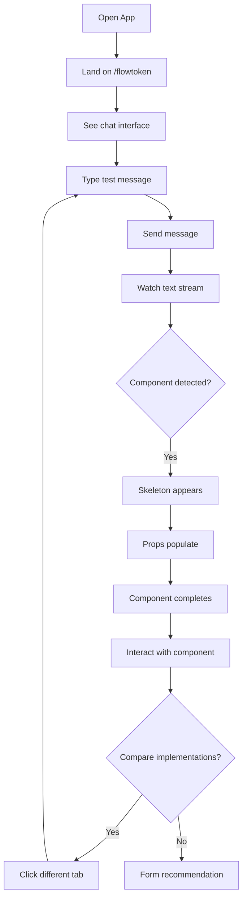
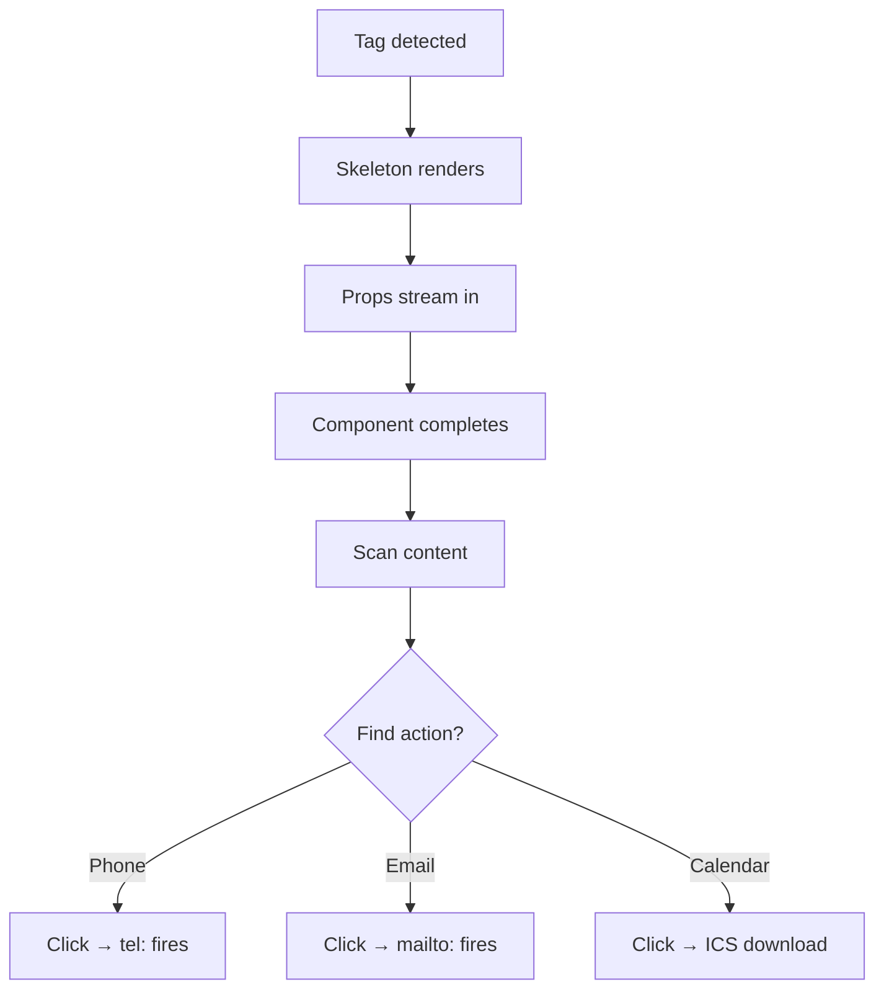
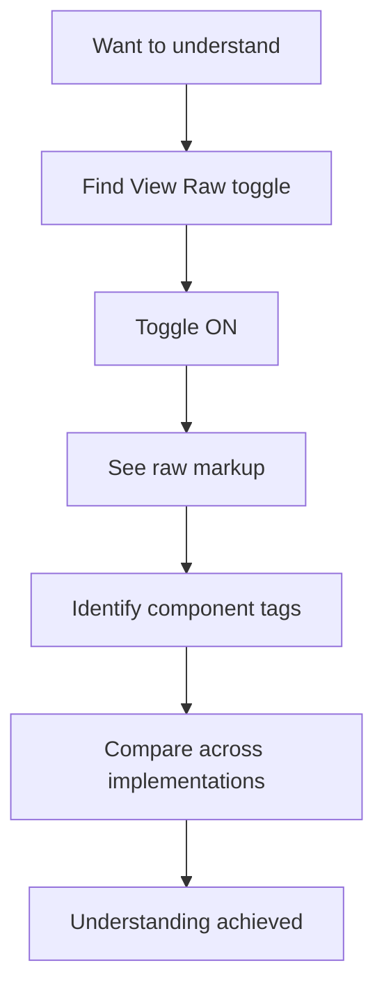

# UX Design Specification: stream-gen-ui

**Author:** GeoloeG
**Date:** 2026-01-19

---

## Executive Summary

### Project Vision

stream-gen-ui is a proof-of-concept demonstrating how AI chatbots can stream rich, interactive UI components inline with natural language responses. The PoC compares three architectural approaches (FlowToken, llm-ui, Streamdown) to rendering custom components from streaming LLM output, proving feasibility and identifying the optimal production architecture for Neuraflow's municipal chatbot products.

The design follows Neuraflow's established brand language - modern, minimalist, professional - with their signature blue color palette, rounded corners, and clean typography. The goal is a PoC that looks production-ready while clearly demonstrating architectural differences.

### Target Users

**Primary: Neuraflow Technical Evaluators**
- CTO and Tech Lead assessing architectural approaches
- Need clear visual comparison between implementations
- Evaluating production-readiness and code quality
- Looking for evidence of thoughtful UX decisions

**End-State Vision: Municipal Chatbot Citizens**
- German residents navigating bureaucratic processes
- Need actionable UI elements (click-to-call, add-to-calendar)
- Benefit from reduced cognitive load vs. text-only responses
- Require accessible, semantic UI components

### Key Design Challenges

1. **Streaming Visual Feedback** - Communicate AI typing state and progressive component rendering without visual jank or user confusion
2. **Component Island Integration** - Custom components must feel distinct yet visually integrated with flowing text
3. **Cross-Route Consistency** - Three implementations sharing one visual language for fair comparison
4. **Evaluator Navigation** - Clear route switching and optional debugging views (raw output toggle)

### Design Opportunities

1. **Progressive Rendering Excellence** - Make skeleton → populated → interactive transitions visually satisfying
2. **Actionable Component Showcase** - ContactCard and CalendarEvent demonstrating real value (click-to-call, add-to-calendar)
3. **Neuraflow Brand Alignment** - Production-quality visual design matching their existing chatbot aesthetic
4. **Comparison Enhancement** - Potential for side-by-side view or performance metrics display

### Design Reference

**Primary Reference:** Neuraflow chatbot interface (chatbot-ui.png)
**Brand Source:** neuraflow.de

**Color Palette:**
- Primary Blue: #3B82F6
- Header Navy: ~#1E3A5F
- Accent Green: #10B981
- Backgrounds: White, Light Gray
- Text: Dark Gray (#374151), Blue for links

**Visual Style:**
- Rounded corners (12px border-radius)
- Clean, spacious layouts
- Hexagonal geometric accents (brand motif)
- Modern sans-serif typography
- Minimalist, professional aesthetic

## Core User Experience

### Defining Experience

The core experience is watching AI-generated text stream in real-time while custom UI components materialize progressively inline. Users send a message, observe natural language flowing token-by-token, and witness rich interactive components (ContactCard, CalendarEvent) emerge seamlessly within the text stream.

**The "Money Shot" Sequence:**
1. User sends: "Show me John's contact info"
2. Text streams: "Here's the contact information you requested..."
3. `<ContactCard` detected → skeleton component renders immediately
4. Props stream in → name, email, phone populate progressively
5. Tag closes → component becomes fully interactive
6. User clicks phone number → click-to-call fires

This 5-second sequence demonstrates the entire value proposition: actionable UI emerging naturally from LLM output.

### Platform Strategy

| Aspect | Decision |
|--------|----------|
| **Platform** | Web (Next.js App Router) |
| **Primary Input** | Desktop-first (mouse/keyboard) for evaluators |
| **Responsive** | Functional on mobile, optimized for desktop |
| **Offline** | Not required (mock stream provider is local) |
| **Browser Support** | Modern browsers (Chrome, Firefox, Safari, Edge) |

### Navigation Architecture

**Persistent Header Tabs:**
- Always visible header with implementation tabs: `FlowToken | llm-ui | Streamdown`
- Current route clearly indicated (active tab state)
- One-click switching between implementations
- Same chat state doesn't persist across routes (fresh conversation per implementation)

**Debug Features:**
- "View Raw Output" toggle in header or per-message
- Shows actual streamed markup alongside rendered output
- Helps evaluators understand what each parser is receiving

### Effortless Interactions

| Interaction | Must Be Effortless |
|-------------|-------------------|
| **Route switching** | Single click, instant navigation |
| **Sending messages** | Enter to send, clear input feedback |
| **Reading stream** | Smooth token flow, no jank or flicker |
| **Component interaction** | Click-to-call, click-to-email work immediately |
| **Understanding state** | Clear "AI typing" indicator during stream |
| **Comparing implementations** | Same test content, consistent layout across routes |

### Critical Success Moments

1. **First Component Render** - The moment a user sees `<ContactCard>` transform from markup into a real, styled component mid-stream. This is the "wow" moment.

2. **Progressive Prop Population** - Watching the skeleton fill in with actual data as props stream. Proves the architecture handles partial state gracefully.

3. **Interactive Confirmation** - Clicking a phone number or email link and seeing it work. Transforms from "neat demo" to "production-viable pattern."

4. **Smooth Comparison** - Switching between implementations and immediately noticing UX differences (animation smoothness, rendering timing). Enables informed architectural decisions.

5. **Raw Output Understanding** - Toggling "View Raw" and seeing the actual markup that produced the rendered output. Builds evaluator confidence in the approach.

### Experience Principles

1. **Progressive Over Complete** - Show something immediately, refine as data arrives. Skeletons → partial → complete. Never block on "waiting for all data."

2. **Islands of Interaction** - Custom components are self-contained, interactive units within flowing text. They don't disrupt the reading flow; they enhance it.

3. **Transparent Architecture** - The "View Raw" toggle and clear route labeling let evaluators understand what they're seeing. No magic boxes.

4. **Comparison-First Design** - Every design decision should make it easy to compare implementations. Consistent layout, same test content, clear differentiators.

5. **Production Credibility** - Even as a PoC, the UI should feel polished enough to imagine in production. Neuraflow brand alignment reinforces this.

## Desired Emotional Response

### Primary Emotional Goals

**For Technical Evaluators:**
- **Impressed** - "This candidate thinks architecturally and executes thoroughly"
- **Confident** - "I can see exactly how this scales to production"
- **Clear** - "I know which implementation approach to recommend"

**For End-User Vision (Citizens):**
- **Empowered** - "I can actually act on this response without leaving the chat"
- **Relieved** - "No more parsing text walls and copying phone numbers"
- **Accomplished** - "Task complete, all within one interface"

### Emotional Journey Mapping

| Stage | Desired Emotion | Design Support |
|-------|-----------------|----------------|
| First load | Curiosity → Recognition | Clean layout, brand familiarity |
| Send message | Anticipation | Clear typing indicator |
| Watch stream | Delight | Smooth token flow, no jank |
| Component appears | Wow / Impressed | Satisfying skeleton → populated transition |
| Click action | Confirmation | "It actually works" builds trust |
| Switch routes | Understanding | Clear differences, fair comparison |
| Toggle raw output | Insight | "I see the architecture" |
| Overall | Confidence | "Production-ready thinking" |

### Micro-Emotions

**Prioritize:**

| Emotion Pair | Target | Rationale |
|--------------|--------|-----------|
| Confidence over Confusion | Critical | Must always understand current state |
| Trust over Skepticism | Critical | Must feel production-quality |
| Delight over Satisfaction | High | Progressive rendering should spark joy |
| Insight over Mystery | High | Transparency via raw output toggle |
| Control over Helplessness | Medium | Predictable navigation and behavior |

**Avoid:**
- **Confusion** - Mitigate with clear labels and route indicators
- **Frustration** - Mitigate with graceful errors, never hang
- **Boredom** - Mitigate with engaging streaming animations
- **Distrust** - Mitigate with raw output transparency

### Design Implications

| Desired Emotion | UX Design Approach |
|-----------------|-------------------|
| Impressed | Neuraflow brand polish, no visual rough edges |
| Confident | Clear route labels, consistent behavior, obvious states |
| Delighted | Satisfying skeleton animations, smooth streaming |
| Trusting | Raw output toggle reveals underlying markup |
| Empowered | Interactive components with real actions (click-to-call) |
| Clear-headed | Identical layouts across routes for fair comparison |

### Emotional Design Principles

1. **Polish Builds Trust** - Production-quality visuals signal production-quality thinking. Every pixel matters for evaluator confidence.

2. **Transparency Creates Confidence** - The "View Raw" toggle is a trust-building feature, not just debugging. Showing markup removes skepticism.

3. **Progressive Rendering = Delight** - The skeleton → populated transition should feel satisfying, almost magical. This is the emotional climax.

4. **Consistency Enables Comparison** - Identical layouts reduce cognitive load and let evaluators focus on meaningful architectural differences.

5. **Actionable = Empowering** - Components that actually work (click-to-call fires) transform demo from interesting to desirable.

## UX Pattern Analysis & Inspiration

### Inspiring Products Analysis

#### ChatGPT - Streaming Chat Gold Standard

**What they do well:**
- Smooth, consistent token-by-token rendering without jank
- Clear visual distinction between user (right-aligned, colored) and assistant (left-aligned, neutral)
- Subtle "thinking" indicator with animated dots
- Auto-scroll that follows content naturally, pauses when user scrolls up
- Markdown rendering with syntax-highlighted code blocks
- Copy button appears on hover - low visual noise until needed

**Key UX insight:** Streaming should feel like watching someone type, not like loading content. The pace matters as much as the rendering.

#### Claude.ai - Artifacts & Component Islands

**What they do well:**
- Artifacts (code, diagrams, documents) appear as distinct "islands" alongside conversation
- Clear visual framing - artifacts have their own container with header and actions
- Artifacts are interactive while conversation continues streaming
- Toggle between rendered view and source code
- "Open in..." actions for deeper engagement

**Key UX insight:** Rich content needs clear visual boundaries to avoid disrupting the reading flow. The container itself communicates "this is different from regular text."

#### Vercel v0 - Generated UI in Conversation

**What they do well:**
- Generated components appear with code/preview toggle
- Real-time preview updates as code generates
- Clear framing distinguishes generated UI from chat messages
- Progressive rendering - partial components visible during generation
- Copy and deploy actions immediately available

**Key UX insight:** Showing both the source and the rendered result builds trust and understanding. The "View Raw" pattern we planned aligns with this.

#### Neuraflow Chatbot - Target Brand Reference

**What they do well:**
- Clean, professional municipal aesthetic
- Structured information via bulleted lists and clear headings ("Kontakt")
- Blue links for all actionable items (phone numbers, emails, URLs)
- Suggested question chips reduce typing friction
- Thumbs up/down feedback is unobtrusive but accessible
- Audio playback option for accessibility
- Clear attribution footer

**Key UX insight:** Municipal/government UX must prioritize clarity and trust over flashiness. Professional polish signals reliability.

#### Slack - Rich Embeds in Conversation

**What they do well:**
- Link unfurls appear as distinct cards within message flow
- Cards have consistent styling but don't break reading rhythm
- Interactive elements (buttons, menus) work inline
- Clear visual hierarchy: message text → embedded content → actions

**Key UX insight:** Embedded content should enhance, not interrupt. The card pattern creates visual separation without disruption.

#### Notion AI - Inline Progressive Generation

**What they do well:**
- AI-generated content appears inline with existing document
- Purple highlight indicates "AI is writing here"
- Progressive character rendering feels natural
- Seamless transition from "generating" to "complete"
- Accept/reject actions appear after generation

**Key UX insight:** Visual indication of "AI-generated content" boundaries helps users understand what's happening without explicit labels.

### Transferable UX Patterns

#### Navigation Patterns

| Pattern | Source | Application to stream-gen-ui |
|---------|--------|------------------------------|
| **Persistent tab navigation** | Slack, Notion | Header tabs for FlowToken / llm-ui / Streamdown |
| **Active state indication** | All | Clear visual for current route |
| **View toggle** | v0, Claude | "View Raw" toggle for markup visibility |

#### Streaming Patterns

| Pattern | Source | Application to stream-gen-ui |
|---------|--------|------------------------------|
| **Token-by-token flow** | ChatGPT, Claude | Smooth text streaming without batching |
| **Typing indicator** | ChatGPT | Animated indicator during generation |
| **Auto-scroll with override** | ChatGPT | Follow content, pause on user scroll-up |
| **Progressive component render** | v0 | Skeleton → partial → complete for custom components |

#### Component Island Patterns

| Pattern | Source | Application to stream-gen-ui |
|---------|--------|------------------------------|
| **Distinct container framing** | Claude artifacts | ContactCard/CalendarEvent have clear boundaries |
| **Card-style embedding** | Slack, Neuraflow | Components as cards within message flow |
| **Interactive while streaming** | Claude | Components clickable once props are sufficient |
| **Source/rendered toggle** | v0 | "View Raw" shows markup alongside rendered |

#### Interaction Patterns

| Pattern | Source | Application to stream-gen-ui |
|---------|--------|------------------------------|
| **Blue link affordance** | Neuraflow | Phone, email links clearly actionable |
| **Hover-reveal actions** | ChatGPT | Copy button appears on hover, not always visible |
| **Click-to-action** | Neuraflow | tel: and mailto: links work immediately |
| **Suggested inputs** | Neuraflow | Question chips could pre-populate test scenarios |

#### Visual Patterns

| Pattern | Source | Application to stream-gen-ui |
|---------|--------|------------------------------|
| **User/assistant distinction** | ChatGPT | Right-align user, left-align assistant (or color coding) |
| **Rounded containers** | All | 12px border-radius per Neuraflow brand |
| **Subtle shadows** | Slack, Notion | Cards have depth without heaviness |
| **Monospace for code/markup** | v0, Claude | Raw output view uses monospace font |

### Anti-Patterns to Avoid

| Anti-Pattern | Why Problematic | Mitigation |
|--------------|-----------------|------------|
| **Batched token rendering** | Creates jerky, loading-bar feel instead of natural typing | Render token-by-token at consistent pace |
| **Blocking on incomplete markup** | UI freezes waiting for tag to close | Show skeleton immediately on tag detection |
| **Jarring component insertion** | Component "pops in" disrupting reading | Animate entry with subtle fade/scale |
| **Hidden raw output** | Evaluators can't understand what's happening | Always-available "View Raw" toggle |
| **Inconsistent layouts across routes** | Makes comparison difficult | Identical structure, only parser differs |
| **Over-animated everything** | Distracting, reduces professional feel | Subtle animations, disable on completed messages |
| **Unclear current state** | User doesn't know which route they're viewing | Persistent header with clear active indication |
| **Auto-scroll that fights user** | Frustrating when trying to read earlier content | Pause auto-scroll when user scrolls up |

### Design Inspiration Strategy

#### Adopt Directly

| Pattern | Rationale |
|---------|-----------|
| **ChatGPT streaming UX** | Proven gold standard, users have trained expectations |
| **Neuraflow visual language** | Direct brand alignment for evaluators |
| **Card-style component embedding** | Clear boundaries without disruption |
| **Blue link affordance** | Universal actionability signal |
| **Hover-reveal secondary actions** | Reduces visual noise |

#### Adapt for Our Context

| Pattern | Original | Adaptation |
|---------|----------|------------|
| **Claude artifacts side panel** | Full side panel | Inline cards (PoC is single-column) |
| **v0 code/preview split** | Side-by-side | Toggle between views (simpler) |
| **Slack rich embeds** | Link unfurling | Component tags as "structured unfurls" |
| **Notion AI highlight** | Purple highlight | Skeleton state indicates "still streaming" |

#### Avoid Entirely

| Pattern | Why |
|---------|-----|
| **Heavy animations everywhere** | Conflicts with professional municipal aesthetic |
| **Complex multi-panel layouts** | PoC needs simplicity for comparison focus |
| **Hidden debugging info** | Evaluators need transparency |
| **Opinionated chat bubbles** | Could distract from component rendering focus |

### Inspiration Summary

**Primary Influence:** ChatGPT streaming mechanics + Neuraflow visual brand
**Secondary Influence:** Claude artifacts for component framing + v0 for source/preview toggle
**Tertiary Influence:** Slack embeds for inline card patterns

The goal is a familiar chat experience (ChatGPT-trained expectations) with Neuraflow's professional aesthetic, enhanced by the component island pattern that makes this PoC unique.

## Design System Foundation

### Design System Choice

**Selected:** Tailwind CSS 4.x + shadcn/ui components

**Stack Architecture:**
1. **Base Layer:** Tailwind CSS 4.x with custom Neuraflow theme
2. **Component Layer:** shadcn/ui primitives (copied into codebase, fully owned)
3. **Domain Layer:** Custom components for ContactCard, CalendarEvent, streaming UI

### Rationale for Selection

| Factor | Decision Driver |
|--------|-----------------|
| **Speed** | shadcn/ui provides pre-built, accessible components that accelerate development |
| **Brand Control** | Components are copied into codebase - full control for Neuraflow customization |
| **No Lock-in** | No external component library dependency - you own all code |
| **Accessibility** | Built on Radix primitives - WCAG compliance by default |
| **Tailwind-Native** | Designed for Tailwind, uses same utility-first patterns |
| **Modern Stack** | Full React 19 and Next.js App Router compatibility |

### Implementation Approach

**From shadcn/ui (accelerators):**
- `Button` - send button, action buttons
- `Input` - chat input field
- `Tabs` - route navigation header
- `Toggle` - "View Raw" toggle
- `Card` - base for custom components
- `Skeleton` - progressive loading states

**Custom Components (domain-specific):**
- `ContactCard` - name, email, phone with click-to-action
- `CalendarEvent` - title, date, time, location with add-to-calendar
- `MessageBubble` - user/assistant message styling
- `StreamingText` - text with streaming animation
- `RawOutputView` - monospace markup display

### Customization Strategy

**Design Tokens (Neuraflow Brand):**

| Token | Value | Usage |
|-------|-------|-------|
| `--color-primary` | #3B82F6 | Primary actions, links |
| `--color-header` | #1E3A5F | Header background |
| `--color-accent` | #10B981 | Success states, secondary actions |
| `--color-text` | #374151 | Body text |
| `--color-link` | #3B82F6 | Clickable links |
| `--radius` | 12px | All border-radius values |
| `--font-sans` | System sans-serif stack | Body typography |
| `--font-mono` | System monospace stack | Raw output, code |

**Customization Rules:**
1. All shadcn/ui components receive Neuraflow token overrides
2. Consistent 12px border-radius across all containers
3. Blue (#3B82F6) for all clickable/actionable elements
4. Professional minimal aesthetic - no decorative elements
5. Skeleton loading states match final component dimensions

## Defining Experience

### The Core Interaction

**Defining Experience:** "Watch custom UI components materialize inline as text streams"

This is the "magic moment" - the transition from `<ContactCard name="...` appearing in the stream to a fully-rendered, interactive contact card materializing mid-sentence. This single interaction proves the entire value proposition of stream-gen-ui.

**Why This is THE Defining Experience:**
- It's the novel element that differentiates this PoC
- It creates the "wow" moment for technical evaluators
- It demonstrates the citizen value proposition (actionable UI)
- Everything else (navigation, comparison, styling) supports this core moment

### User Mental Model

**Current Approach (What Users Know):**
- AI chat = text streaming (ChatGPT-trained)
- Rich content in chat = link unfurls, previews (Slack/iMessage-trained)
- Loading states = skeleton placeholders (modern web-trained)

**The Novel Element:**
- Components appearing MID-STREAM is new
- Users haven't seen UI components emerge from flowing text
- Need to make it feel natural through familiar patterns (skeletons) and smooth animation

**Potential Confusion Points:**
- First skeleton appearance: "What's happening?"
- Understanding component source: "Where did this come from?"
- Completion timing: "When can I interact with it?"

**Mitigation Strategy:**
- Immediate skeleton render reduces surprise
- Smooth animation makes emergence feel natural
- Clear completion signal (visual settle) indicates interactivity
- "View Raw" toggle explains the architecture

### Success Criteria

| Criteria | Target | Measurement |
|----------|--------|-------------|
| Skeleton appearance | <100ms from tag detection | Visual inspection |
| Prop population | No flicker or reflow | Visual smoothness |
| Completion signal | Clear visual transition | User recognizes "done" state |
| Interactivity timing | Instant on tag close | Click-to-call works immediately |
| Reading continuity | Text flows around component | No disruption to reading |
| Architecture clarity | Understandable via toggle | Evaluator comprehension |

**Success Statement:** User says "I just watched that contact card build itself while the AI was typing - and I can call directly from it!"

### Novel UX Patterns

| Aspect | Pattern Type | Design Approach |
|--------|--------------|-----------------|
| Chat streaming | Established | Follow ChatGPT conventions exactly |
| Component cards | Established | Use Slack/iMessage unfurl familiarity |
| Loading skeletons | Established | Standard gray placeholder pattern |
| Progressive prop fill | Semi-novel | Animate field-by-field with subtle fades |
| Mid-stream emergence | Novel | Smooth insertion, no reading disruption |

**Innovation Within Familiarity:**
The core innovation (mid-stream component rendering) is wrapped in familiar patterns (skeletons, cards, streaming) to reduce cognitive load. Users recognize the pieces; the combination is new.

### Experience Mechanics

**Phase 1: Initiation**
```
User sends: "Show me John's contact info"
AI streams: "Here's the contact information you requested..."
```

**Phase 2: Tag Detection**
```
Stream contains: <ContactCard
Action: Immediately render skeleton card
Visual: Gray placeholder appears inline with text
Timing: <100ms from tag detection
```

**Phase 3: Progressive Population**
```
Stream: name="John Doe"     → Name field fades in
Stream: email="john@..."    → Email field fades in
Stream: phone="+1-555..."   → Phone field fades in
Animation: 150ms ease per field
```

**Phase 4: Completion**
```
Stream: />  or  </ContactCard>
Action: Transition to "complete" state
Visual: Border solidifies, subtle shadow appears
Result: All actions become interactive
```

**Phase 5: Continuation**
```
Text streaming continues after component
Component is now a static "island"
User can interact while more content streams
```

**Phase 6: Debug Mode (View Raw)**
```
Toggle shows actual markup being received
Evaluators see: <ContactCard name="John Doe" email="..."/>
Builds understanding and trust in the architecture
```

## Visual Design Foundation

### Color System

**Core Palette:**

| Role | Hex | Usage |
|------|-----|-------|
| Primary | `#3B82F6` | Buttons, links, active states |
| Header | `#1E3A5F` | Header background |
| Accent | `#10B981` | Success states, secondary CTAs |
| Background | `#FFFFFF` | Main content |
| Surface | `#F9FAFB` | Cards, message bubbles |
| Border | `#E5E7EB` | Dividers, borders |
| Text Primary | `#374151` | Body text |
| Text Secondary | `#6B7280` | Metadata |
| Text Muted | `#9CA3AF` | Disabled, timestamps |

**Semantic Colors:**

| State | Hex |
|-------|-----|
| Link | `#3B82F6` |
| Success | `#10B981` |
| Warning | `#F59E0B` |
| Error | `#EF4444` |
| Skeleton | `#E5E7EB` |

**Component Colors:**

| Component | Background | Border | Text |
|-----------|------------|--------|------|
| User Message | `#3B82F6` | none | `#FFFFFF` |
| Assistant Message | `#F9FAFB` | `#E5E7EB` | `#374151` |
| ContactCard | `#FFFFFF` | `#E5E7EB` | `#374151` |
| CalendarEvent | `#FFFFFF` | `#E5E7EB` | `#374151` |
| Header | `#1E3A5F` | none | `#FFFFFF` |
| Active Tab | `#FFFFFF` | none | `#1E3A5F` |
| Inactive Tab | transparent | none | `#94A3B8` |

### Typography System

| Element | Size | Weight | Line Height |
|---------|------|--------|-------------|
| H2 | 20px | 600 | 1.35 |
| H3 | 16px | 600 | 1.4 |
| Body | 14px | 400 | 1.6 |
| Body Small | 13px | 400 | 1.5 |
| Caption | 12px | 400 | 1.4 |
| Code | 13px | 400 | 1.5 |

**Font Stack:** Inter (sans-serif), JetBrains Mono (monospace)

**Typography Rules:**
1. Chat messages use Body (14px) for readability
2. Component headers use H3 (16px semibold)
3. Clickable links are blue with underline on hover
4. Timestamps and metadata use Caption (12px, muted color)
5. Raw output uses Monospace at Body Small size

### Spacing & Layout Foundation

**Spacing Scale (4px base):**

| Token | Value | Usage |
|-------|-------|-------|
| `space-1` | 4px | Tight spacing, icon gaps |
| `space-2` | 8px | Related elements, inline |
| `space-3` | 12px | Component internal padding |
| `space-4` | 16px | Standard padding |
| `space-6` | 24px | Message spacing |
| `space-8` | 32px | Major section breaks |

**Layout Structure:**
- Max content width: 768px (centered)
- Header height: 56px (fixed)
- Message gap: 24px
- Card padding: 16px
- Input area: sticky bottom, auto-height

**Border Radius:**

| Token | Value | Usage |
|-------|-------|-------|
| `radius-sm` | 6px | Buttons, inputs |
| `radius-md` | 8px | Tags, chips |
| `radius-lg` | 12px | Cards, messages (Neuraflow standard) |
| `radius-full` | 9999px | Avatars, circular buttons |

**Shadows:**

| Token | Value | Usage |
|-------|-------|-------|
| `shadow-sm` | `0 1px 2px rgba(0,0,0,0.05)` | Inputs |
| `shadow-md` | `0 4px 6px rgba(0,0,0,0.07)` | Cards, components |
| `shadow-lg` | `0 10px 15px rgba(0,0,0,0.1)` | Modals |

### Accessibility Considerations

| Requirement | Target | Implementation |
|-------------|--------|----------------|
| Color Contrast | WCAG AA (4.5:1) | All text verified |
| Focus Indicators | Visible | Blue focus ring |
| Link Identification | Distinguishable | Blue + underline hover |
| Touch Targets | 44x44px minimum | All buttons meet |
| Font Sizing | 12px minimum | No smaller text |
| Motion | Reduced support | `prefers-reduced-motion` |

**Verified Contrast Ratios:**

| Combination | Ratio | Pass |
|-------------|-------|------|
| Text on White | 8.59:1 | AAA |
| Text on Surface | 7.94:1 | AAA |
| Primary on White | 4.54:1 | AA |
| White on Header | 10.87:1 | AAA |

## Design Direction Decision

### Design Directions Explored

Six design directions were explored within the Neuraflow brand language:

| Direction | Approach | Key Characteristic |
|-----------|----------|-------------------|
| A | Compact Header | Single-row header, maximum chat area |
| B | Full-width Tabs | Prominent tab bar, clear comparison |
| C | Side Navigation | Vertical nav rail, dashboard feel |
| D | Floating Containers | Rounded floating elements, modern/airy |
| E | Minimal Header | Light header, underline tabs |
| F | Full-width Messages | Role labels, document-style layout |

Interactive mockups generated at: `ux-design-directions.html`

### Chosen Direction

**Selected: Direction A - Compact Header**

This direction was chosen for:
- Closest alignment with Neuraflow chatbot reference
- Maximum vertical space for chat content
- Clear but unobtrusive route navigation
- Familiar ChatGPT-style layout patterns
- Component islands remain the visual focus

### Design Rationale

| Factor | Direction A Advantage |
|--------|----------------------|
| Brand Alignment | Matches Neuraflow chatbot-ui.png reference closely |
| Content Focus | Minimal header chrome maximizes chat area |
| Evaluator UX | Clear tab navigation for route comparison |
| Component Showcase | Components are the visual highlight, not chrome |
| User Familiarity | Matches trained expectations from ChatGPT/Claude |

### Implementation Approach

**Header Structure:**
- Fixed position, 56px height
- Navy background (#1E3A5F)
- Left: Logo/title (optional)
- Center: Implementation tabs (FlowToken | llm-ui | Streamdown)
- Right: "View Raw" toggle

**Tab Styling:**
- Inactive: semi-transparent white text, transparent background
- Active: white background, navy text
- Hover: slightly increased opacity

**Chat Area:**
- Full remaining height (flex: 1)
- Light gray background (#F9FAFB)
- 768px max-width content, centered
- 24px gap between messages

**Input Area:**
- Sticky bottom
- White background
- Rounded input field + send button

## User Journey Flows

### Journey 1: Evaluator Demo Flow

**Goal:** Experience streaming component pattern, compare implementations



**Key Moments:**
- Landing invites immediate action
- Streaming feels smooth and alive
- Skeleton → complete is the "wow" moment
- Tab switching is instant

### Journey 2: Component Interaction Flow

**Goal:** Understand and interact with rendered component



**Key Moments:**
- Skeleton recognizable as "loading card"
- Progressive population feels satisfying
- Completion signal is clear
- Actionable elements have obvious affordances

### Journey 3: Architecture Investigation Flow

**Goal:** Understand underlying markup and parsing



**Key Moments:**
- Toggle is discoverable
- Raw clearly associated with rendered
- Monospace font signals "code"
- Can compare same content across implementations

### Journey Patterns

**Navigation:**
- Tab-based route switching (fresh chat per implementation)
- Persistent debug toggle across routes
- Auto-scroll during streaming, pause on user scroll

**Feedback:**
- Streaming indicator (animated dots)
- Progressive skeleton with shimmer
- Completion signal (shadow appears)
- Hover affordance (blue underline)

**Error Handling:**
- Malformed tags: show raw gracefully
- Network errors: clear state + retry
- Incomplete components: show partial with indication

### Flow Optimization Principles

| Principle | Implementation |
|-----------|----------------|
| Minimal steps to value | Direct to chat, no onboarding |
| Progressive disclosure | Details on demand (View Raw) |
| Clear progress indicators | Dots, shimmer, completion signals |
| Forgiving interactions | Instant tab switches, reversible toggle |
| Consistency | Same layout across all implementations |

## Component Strategy

### Design System Components

**From shadcn/ui (customized with Neuraflow tokens):**
- `Button` - Send button, action buttons
- `Input` - Chat input field
- `Tabs` - Route navigation header
- `Toggle` - "View Raw" toggle
- `Card` - Base for custom components
- `Skeleton` - Loading state primitives
- `ScrollArea` - Chat container

### Custom Components

#### MessageBubble
- **Purpose:** Display chat message (user/assistant)
- **Props:** role, content, timestamp, isStreaming
- **States:** Default, Streaming, With embedded components
- **Styling:** User=blue background/right-aligned, Assistant=white/left-aligned

#### StreamingText
- **Purpose:** Render actively streaming text with cursor
- **Props:** text, isStreaming, onComplete
- **States:** Streaming (cursor visible), Complete (no cursor)
- **Animation:** Blinking cursor via CSS

#### ContactCard
- **Purpose:** Display contact information with actionable links
- **Props:** name, phone, email, address, avatar, isComplete
- **States:** Skeleton, Partial (props streaming), Complete (interactive)
- **Actions:** tel: link for phone, mailto: link for email
- **Accessibility:** ARIA labels for all interactive elements

#### CalendarEvent
- **Purpose:** Display calendar event with add-to-calendar action
- **Props:** title, date, startTime, endTime, location, description, isComplete
- **States:** Skeleton, Partial, Complete
- **Actions:** ICS file download or Google Calendar link

#### RawOutputView
- **Purpose:** Debug view showing raw streamed markup
- **Props:** content, isStreaming
- **Styling:** Monospace font, dark background, optional syntax highlighting
- **States:** Streaming (with cursor), Complete

#### TypingIndicator
- **Purpose:** Show AI is generating response
- **Props:** isVisible
- **Animation:** Three dots with staggered bounce animation

### Component Implementation Strategy

**Architecture Layers:**
1. **Foundation:** shadcn/ui components with Neuraflow token overrides
2. **Chat Layer:** MessageBubble, StreamingText, TypingIndicator
3. **Domain Layer:** ContactCard, CalendarEvent (extend Card patterns)
4. **Debug Layer:** RawOutputView

**Consistency Rules:**
- All components use design tokens from globals.css
- 12px border-radius on all card containers
- Blue (#3B82F6) for all actionable/clickable elements
- Consistent skeleton shimmer animation across all loading states
- Shadow appears on component completion (visual signal)

### Implementation Roadmap

| Phase | Components | Priority | Rationale |
|-------|------------|----------|-----------|
| 1 - Core | MessageBubble, StreamingText, TypingIndicator, ContactCard | P0 | Required for basic demo |
| 2 - Complete | CalendarEvent, RawOutputView | P1 | Full feature set |
| 3 - Polish | Enhanced skeletons, Error states, Edge cases | P2 | Production quality |

## UX Consistency Patterns

### Streaming & Loading States

| State | Visual | Timing |
|-------|--------|--------|
| AI Generating | Three bouncing dots (TypingIndicator) | Until first token |
| Text Streaming | Progressive text + blinking cursor | During stream |
| Component Skeleton | Gray placeholder + shimmer animation | <100ms from tag detection |
| Component Partial | Fields fade in as props arrive | 150ms per field |
| Component Complete | Shadow appears, fully interactive | Instant on closing tag |

### Action Hierarchy

| Level | Treatment | Examples |
|-------|-----------|----------|
| Primary | Blue filled (#3B82F6), white text | Send button, Add to Calendar |
| Secondary | Blue text, underline on hover | Phone/email links |
| Tertiary | Gray, subtle, icon-based | Toggle switch, copy button |
| Navigation | Tab with active indicator | Route tabs |

### Link Patterns

**All Actionable Text:**
- Color: Blue (#3B82F6)
- Default: No underline
- Hover: Underline appears, cursor pointer
- Focus: 2px blue focus ring

**Specific Link Types:**
- **Phone:** `tel:` protocol → opens dialer
- **Email:** `mailto:` protocol → opens email client
- **URL:** Opens in new tab, optional external icon

### Navigation Patterns

**Tab Navigation (Route Switching):**
- Active: White background, navy text
- Inactive: Transparent background, white text at 70% opacity
- Hover: White text at 100% opacity
- Behavior: Instant route change, fresh chat per implementation

**Toggle (View Raw):**
- Off: Gray track, knob left
- On: Blue track, knob right
- Transition: 150ms ease
- Persistence: State persists across tab switches

**Auto-Scroll Behavior:**
- Default: Scroll follows new streaming content
- User scrolls up: Auto-scroll pauses
- User scrolls to bottom: Auto-scroll resumes

### Feedback Patterns

| Situation | Visual Feedback |
|-----------|-----------------|
| Success (component complete) | Shadow appears, subtle scale pulse |
| Error (network) | Red banner at top with retry button |
| Error (parse) | Show raw markup with red border |
| Empty (initial) | "Send a message to start" centered |

### Transition Timing

| Element | Duration | Easing |
|---------|----------|--------|
| Skeleton shimmer | 1.5s loop | linear |
| Prop fade-in | 150ms | ease-out |
| Component completion | 200ms | ease-out |
| Tab switch | instant | - |
| Toggle | 150ms | ease |
| Cursor blink | 1s loop | steps |

### Keyboard & Accessibility Patterns

**Focus Management:**
- Visible focus ring (2px blue) on all interactive elements
- Tab order: Header tabs → Toggle → Chat messages → Input field
- Skip link option for keyboard users

**Keyboard Shortcuts:**

| Element | Key | Action |
|---------|-----|--------|
| Route tabs | ← → | Navigate between tabs |
| Route tabs | Enter | Select tab |
| Toggle | Space | Toggle on/off |
| Input | Enter | Send message |
| Links | Enter | Activate link |

**Screen Reader Support:**
- `aria-live="polite"` on chat message container
- Components announce completion state
- Links have descriptive `aria-label` attributes

## Responsive Design & Accessibility

### Responsive Strategy

**Approach:** Desktop-first, mobile-functional

| Device | Priority | Strategy |
|--------|----------|----------|
| Desktop (1024px+) | Primary | Full layout, optimal experience |
| Tablet (768-1023px) | Secondary | Same structure, minor padding adjustments |
| Mobile (320-767px) | Tertiary | Functional, stacked layout where needed |

### Breakpoint Strategy

Using Tailwind defaults:
- `sm`: 640px
- `md`: 768px (tablet adaptations)
- `lg`: 1024px (full desktop)
- `xl`: 1280px (wider content optional)

**Responsive Behaviors:**

| Component | Desktop | Tablet | Mobile |
|-----------|---------|--------|--------|
| Header | Single row, tabs centered | Same | Tabs scrollable if needed |
| Chat area | 768px max-width, centered | Full width + padding | Full width, minimal padding |
| Messages | 85% max-width | Same | 95% max-width |
| Components | Full card layout | Same | Slightly narrower |
| Input | Comfortable padding | Same | Reduced padding |

### Accessibility Strategy

**Target:** WCAG 2.1 Level AA

| Requirement | Implementation |
|-------------|----------------|
| Color Contrast | 4.5:1 minimum, all combinations verified |
| Focus Indicators | 2px blue ring on all interactive elements |
| Keyboard Navigation | Full operability, logical tab order |
| Screen Readers | Semantic HTML, ARIA labels, live regions |
| Touch Targets | 44x44px minimum on all interactive elements |
| Motion | `prefers-reduced-motion` query respected |
| Zoom | Functional and readable at 200% zoom |

**Streaming-Specific Accessibility:**
- `aria-live="polite"` on message container for dynamic updates
- Component loading/completion states announced to screen readers
- Auto-scroll respects user scroll position (pauses when user scrolls up)

### Testing Strategy

**Responsive Testing:**
- Browser DevTools responsive modes
- Real device testing: iPhone, Android phone, iPad
- Test at each breakpoint boundary

**Accessibility Testing:**
- Automated: axe-core, Lighthouse accessibility audit
- Keyboard: Full navigation without mouse
- Screen Reader: VoiceOver (Mac), NVDA (Windows)
- Color: Simulate color blindness modes
- Zoom: Test at 200% browser zoom

### Implementation Guidelines

**Responsive CSS:**
- Use relative units (rem, %) over fixed pixels
- Mobile-first media queries (default mobile, override for larger)
- Maintain touch targets across all breakpoints

**Accessibility HTML:**
- Semantic HTML structure (article, nav, main, etc.)
- Skip links for keyboard users
- ARIA labels on all interactive elements
- Live regions for dynamic content updates

**Motion Reduction:**
```css
@media (prefers-reduced-motion: reduce) {
  /* Disable shimmer, typing indicator animations */
  animation: none;
  transition: none;
}
```
